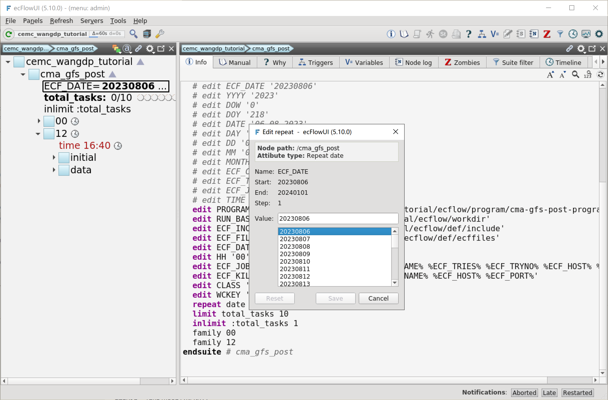

添加日期循环
=====================

现在我们有了一个相对完整的 CMA-GFS 后处理 ecFlow 流程，能够处理某天 00 和 12 两个时次的模式输出。
日期通过 cma_gfs_post 节点的变量 (``ECF_DATE``) 指定。
当我们想要运行其他日期的后处理流程时，可以手动将 ECF_DATE 变量设置为其他时间。
业务系统不可能每天都要求运维人员手动调整参数，人为操作越多就容易引发故障。

本节将介绍本教程中最后一个概念，会将仅用于单次模式试验的流程改造为可以滚动运行的业务系统流程。

在本节中，我们将为 CMA-GFS 后处理工作流添加日期循环 (``RepeatDate``)。
在日期循环和时间依赖的帮助下，工作流将实现每天自动运行。

更新工作流定义
--------------

更新 ``${TUTORIAL_HOME}/def`` 中的工作流定义文件 **cma_gfs_post.py**：

.. code-block:: py
    :linenos:
    :emphasize-lines: 51

    import os

    import ecflow

    def slurm_serial(class_name, wckey):
        variables = {
            "ECF_JOB_CMD": "slsubmit6 %ECF_JOB% %ECF_NAME% %ECF_TRIES% %ECF_TRYNO% %ECF_HOST% %ECF_PORT%",
            "ECF_KILL_CMD": "slcancel4 %ECF_RID% %ECF_NAME% %ECF_HOST% %ECF_PORT%",
        	"CLASS": class_name,
            "WCKEY": wckey,
        }
        return variables

    def slurm_parallel(nodes, tasks_per_node, class_name, wckey):
        variables = {
            "ECF_JOB_CMD": "slsubmit6 %ECF_JOB% %ECF_NAME% %ECF_TRIES% %ECF_TRYNO% %ECF_HOST% %ECF_PORT%",
            "ECF_KILL_CMD": "slcancel4 %ECF_RID% %ECF_NAME% %ECF_HOST% %ECF_PORT%",
            "NODES": nodes,
            "TASKS_PER_NODE": tasks_per_node,
        	"CLASS": class_name,
            "WCKEY": wckey,
        }
        return variables

    current_path = os.path.dirname(__file__)
    tutorial_base = os.path.abspath(os.path.join(current_path, "../"))
    def_path = os.path.join(tutorial_base, "def")
    ecfout_path = os.path.join(tutorial_base, "ecfout")
    program_base_dir = os.path.join(tutorial_base, "program/cma-gfs-post-program")
    run_base_dir = os.path.join(tutorial_base, "workdir")

    defs = ecflow.Defs()

    with defs.add_suite("cma_gfs_post") as suite:
        suite.add_variable("PROGRAM_BASE_DIR", program_base_dir)
        suite.add_variable("RUN_BASE_DIR", run_base_dir)

        suite.add_variable("ECF_INCLUDE", os.path.join(def_path, "include"))
        suite.add_variable("ECF_FILES", os.path.join(def_path, "ecffiles"))

        suite.add_variable("ECF_DATE", "20230806")

        suite.add_limit("total_tasks", 10)
        suite.add_inlimit("total_tasks")

        suite.add_variable(slurm_serial("serial", "105-09"))

        suite.add_repeat(ecflow.RepeatDate("ECF_DATE", 20230806, 20240101))

        forecast_hour_list = [ f"{hour:03}" for hour in range(0, 241, 3)]

        start_hours = [
            { "name": "00", "time": "04:40"},
            { "name": "12", "time": "16:40"},
        ]

        for start_hour in start_hours:
            cycle_name = start_hour["name"]
            cycle_time = start_hour["time"]
            with suite.add_family(cycle_name) as fm_start_hour:
                fm_start_hour.add_time(cycle_time)
                fm_start_hour.add_variable("HH", cycle_name)

            with fm_start_hour.add_task("initial") as tk_initail:
                for forecast_hour in forecast_hour_list:
                    tk_initail.add_event(f"modvar_{forecast_hour}")

            with fm_start_hour.add_family("data") as fm_data:
                for forecast_hour in forecast_hour_list:
                    with fm_data.add_family(forecast_hour) as fm_hour:
                        fm_hour.add_variable("FHOUR", forecast_hour)
                        fm_hour.add_trigger(f"../initial:modvar_{forecast_hour}")

                        with fm_hour.add_task("pre_data2grib2") as tk_pre_data2grib2:
                            pass

                        with fm_hour.add_task("data2grib2") as tk_data2grib2:
                            tk_data2grib2.add_variable(slurm_parallel(4, 64, "normal", "105-09"))
                            tk_data2grib2.add_trigger("./pre_data2grib2 == complete")

    print(defs)
    def_output_path = str(os.path.join(def_path, "cma_gfs_post.def"))
    defs.save_as_defs(def_output_path)

新增代码解析：

- 51 行：增加日期循环，从 2023.08.06 开始到 2024.01.01

更新工作流
-----------

挂起 cma_gfs_post 节点，更新 ecFlow 上的工作流：

.. code-block:: bash

    cd ${TUTORIAL_HOME}/def
    python3 cma_gfs_post.py
    ecflow_client --host login_a13 --port 43083 --replace /cma_gfs_post cma_gfs_post.def

双击左侧树形结构中的 ECF_DATE 变量，会弹出修改框，可以选择不同日期：

