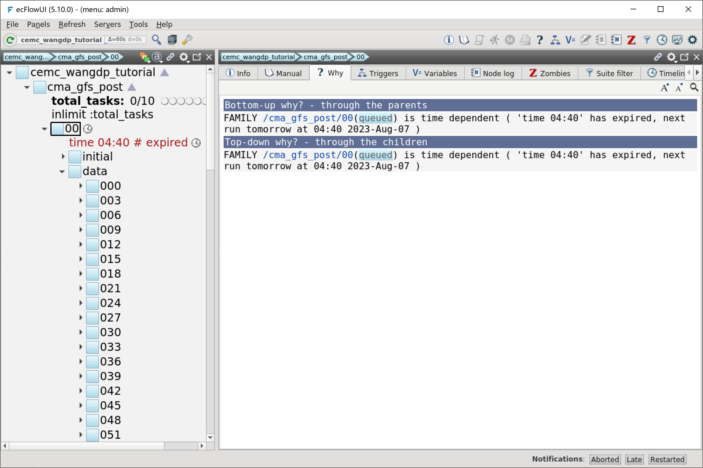
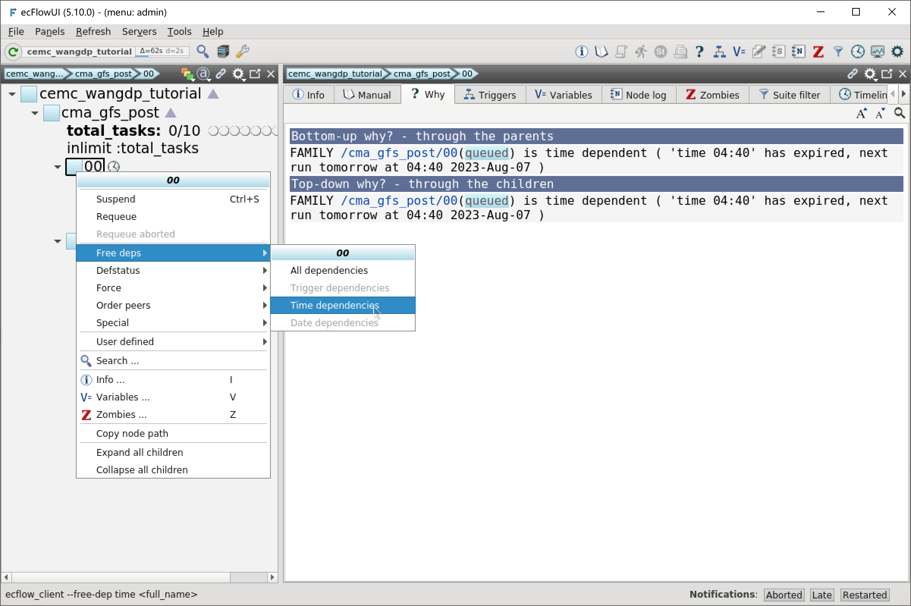
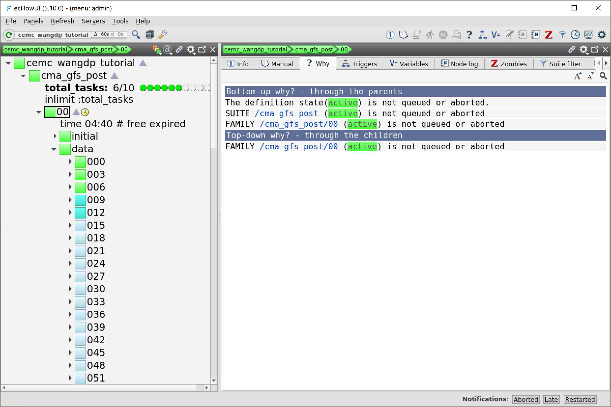

添加时间依赖
=====================

当前我们定义的工作流会在启动后立即运行。
数值天气预报业务系统往往有固定的启动时间，CMA-GFS 00 时次在 UTC 03:40 启动。
处理 00 时次的后处理任务至少在 03:40 之前启动时没有意义的，因此需要添加启动时间限制，类似 Linux crontab 中定义的时间。

本节我们将 CMA-GFS 后处理工作流扩展为支持 00 和 12 两个时次，并为每个时次分别设置启动时间。

更新工作流定义
--------------

更新 ``${TUTORIAL_HOME}/def`` 中的工作流定义文件 **cma_gfs_post.py**：

.. code-block:: py
    :linenos:
    :emphasize-lines: 44,53-56,58-63,69-71,73

    import os

    import ecflow

    def slurm_serial(class_name, wckey):
        variables = {
            "ECF_JOB_CMD": "slsubmit6 %ECF_JOB% %ECF_NAME% %ECF_TRIES% %ECF_TRYNO% %ECF_HOST% %ECF_PORT%",
            "ECF_KILL_CMD": "slcancel4 %ECF_RID% %ECF_NAME% %ECF_HOST% %ECF_PORT%",
        	"CLASS": class_name,
            "WCKEY": wckey,
        }
        return variables

    def slurm_parallel(nodes, tasks_per_node, class_name, wckey):
        variables = {
            "ECF_JOB_CMD": "slsubmit6 %ECF_JOB% %ECF_NAME% %ECF_TRIES% %ECF_TRYNO% %ECF_HOST% %ECF_PORT%",
            "ECF_KILL_CMD": "slcancel4 %ECF_RID% %ECF_NAME% %ECF_HOST% %ECF_PORT%",
            "NODES": nodes,
            "TASKS_PER_NODE": tasks_per_node,
        	"CLASS": class_name,
            "WCKEY": wckey,
        }
        return variables

    current_path = os.path.dirname(__file__)
    tutorial_base = os.path.abspath(os.path.join(current_path, "../"))
    def_path = os.path.join(tutorial_base, "def")
    ecfout_path = os.path.join(tutorial_base, "ecfout")
    program_base_dir = os.path.join(tutorial_base, "program/cma-gfs-post-program")
    run_base_dir = os.path.join(tutorial_base, "workdir")

    defs = ecflow.Defs()

    with defs.add_suite("cma_gfs_post") as suite:
        suite.add_variable("PROGRAM_BASE_DIR", program_base_dir)
        suite.add_variable("RUN_BASE_DIR", run_base_dir)

        suite.add_variable("ECF_INCLUDE", os.path.join(def_path, "include"))
        suite.add_variable("ECF_FILES", os.path.join(def_path, "ecffiles"))

        suite.add_variable("ECF_DATE", "20230806")

        suite.add_limit("total_tasks", 10)
        suite.add_inlimit("total_tasks")

        suite.add_variable(slurm_serial("serial", "105-09"))

        forecast_hour_list = [ f"{hour:03}" for hour in range(0, 241, 3)]

        start_hours = [
            { "name": "00", "time": "04:40"},
            { "name": "12", "time": "16:40"},
        ]

        for start_hour in start_hours:
            cycle_name = start_hour["name"]
            cycle_time = start_hour["time"]
            with suite.add_family(cycle_name) as fm_start_hour:
                fm_start_hour.add_time(cycle_time)
                fm_start_hour.add_variable("HH", cycle_name)

            with fm_start_hour.add_task("initial") as tk_initail:
                for forecast_hour in forecast_hour_list:
                    tk_initail.add_event(f"modvar_{forecast_hour}")

            with fm_start_hour.add_family("data") as fm_data:
                for forecast_hour in forecast_hour_list:
                    with fm_data.add_family(forecast_hour) as fm_hour:
                        fm_hour.add_variable("FHOUR", forecast_hour)
                        fm_hour.add_trigger(f"../initial:modvar_{forecast_hour}")

                        with fm_hour.add_task("pre_data2grib2") as tk_pre_data2grib2:
                            pass

                        with fm_hour.add_task("data2grib2") as tk_data2grib2:
                            tk_data2grib2.add_variable(slurm_parallel(4, 64, "normal", "105-09"))
                            tk_data2grib2.add_trigger("./pre_data2grib2 == complete")

    print(defs)
    def_output_path = str(os.path.join(def_path, "cma_gfs_post.def"))
    defs.save_as_defs(def_output_path)

新增代码解析：

- 44 行：删掉 suite 节点设置的变量 ``HH``
- 53-56 行：时次信息列表，包含时次名称 (name) 和启动时间 (time)
- 58-63 行：增加时次节点，每个时次单独设置变量 ``HH``
- 69-71 行：将时效任务放到 data 节点中
- 73 行：由于新增的 data 节点，需要修改触发器中的相对路径

更新工作流
----------

挂起 cma_gfs_post 节点，更新 ecFlow 上的工作流：

.. code-block:: bash

    cd ${TUTORIAL_HOME}/def
    python3 cma_gfs_post.py
    ecflow_client --host login_a13 --port 43083 --replace /cma_gfs_post cma_gfs_post.def

运行任务
---------

恢复挂起的 cma_gfs_post 节点，在 ecFlow UI 中可以看到 00 和 12 时次均没有运行，查看右侧 Why 标签：

可以看到对于 00 时次，因为已过启动时间启动而没有启动。

当我们想要强制运行 00 时次时，就需要手动去除时间依赖条件。
右键点击 00 节点，在弹出菜单中选择 Free deps / Time dependencies，去掉时间依赖。

去掉时间依赖后，00 时次开始自动运行：

