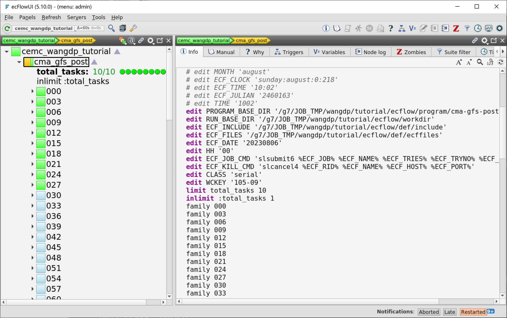

变量继承
=============

上节中我们为每个任务都设置的 Slurm 提交变量，实际上我们可以利用 ecFlow 的变量继承机制简化设置。

修改工作流定义
--------------

更新 ``${TUTORIAL_HOME}/def`` 中的工作流定义文件 **cma_gfs_post.py**：

.. code-block::
    :linenos:
    :emphasize-lines: 50,58-59

    import os

    import ecflow

    def slurm_serial(class_name, wckey):
        variables = {
            "ECF_JOB_CMD": "slsubmit6 %ECF_JOB% %ECF_NAME% %ECF_TRIES% %ECF_TRYNO% %ECF_HOST% %ECF_PORT%",
            "ECF_KILL_CMD": "slcancel4 %ECF_RID% %ECF_NAME% %ECF_HOST% %ECF_PORT%",
        	"CLASS": class_name,
            "WCKEY": wckey,
        }
        return variables

    def slurm_parallel(nodes, tasks_per_node, class_name, wckey):
        variables = {
            "ECF_JOB_CMD": "slsubmit6 %ECF_JOB% %ECF_NAME% %ECF_TRIES% %ECF_TRYNO% %ECF_HOST% %ECF_PORT%",
            "ECF_KILL_CMD": "slcancel4 %ECF_RID% %ECF_NAME% %ECF_HOST% %ECF_PORT%",
            "NODES": nodes,
            "TASKS_PER_NODE": tasks_per_node,
        	"CLASS": class_name,
            "WCKEY": wckey,
        }
        return variables

    current_path = os.path.dirname(__file__)
    tutorial_base = os.path.abspath(os.path.join(current_path, "../"))
    def_path = os.path.join(tutorial_base, "def")
    ecfout_path = os.path.join(tutorial_base, "ecfout")
    program_base_dir = os.path.join(tutorial_base, "program/cma-gfs-post-program")
    run_base_dir = os.path.join(tutorial_base, "workdir")

    defs = ecflow.Defs()

    with defs.add_suite("cma_gfs_post") as suite:
        suite.add_variable("PROGRAM_BASE_DIR", program_base_dir)
        suite.add_variable("RUN_BASE_DIR", run_base_dir)

        suite.add_variable("ECF_INCLUDE", os.path.join(def_path, "include"))
        suite.add_variable("ECF_FILES", os.path.join(def_path, "ecffiles"))

        suite.add_variable("ECF_DATE", "20230806")
        suite.add_variable("HH", "00")

        suite.add_limit("total_tasks", 10)
        suite.add_inlimit("total_tasks")

        suite.add_variable(slurm_serial("serial", "105-09"))

        forecast_hour_list = [ f"{hour:03}" for hour in range(0, 241, 3)]

        for forecast_hour in forecast_hour_list:
            with suite.add_family(forecast_hour) as fm_hour:
                fm_hour.add_variable("FHOUR", forecast_hour)

                with fm_hour.add_task("pre_data2grib2") as tk_pre_data2grib2:
                    pass

                with fm_hour.add_task("data2grib2") as tk_data2grib2:
                    tk_data2grib2.add_variable(slurm_parallel(4, 64, "normal", "105-09"))
                    tk_data2grib2.add_trigger("./pre_data2grib2 == complete")

    print(defs)
    def_output_path = str(os.path.join(def_path, "cma_gfs_post.def"))
    defs.save_as_defs(def_output_path)

- 50 行：为整个 suite 添加串行作业提交需要的变量
- 58-59 行：pre_data2grib2 任务无需再设置 slurm 提交变量

更新工作流
--------------

更新 ecFlow 上的工作流：

.. code-block:: bash

    cd ${TUTORIAL_HOME}/def/ecffiles
    python3 cma_gfs_post.py
    ecflow_client --port 43083 --replace /cma_gfs_post cma_gfs_post.def

从截图中可以看到 suite 节点 cma_gfs_post 的 Slurm 提交相关变量：

