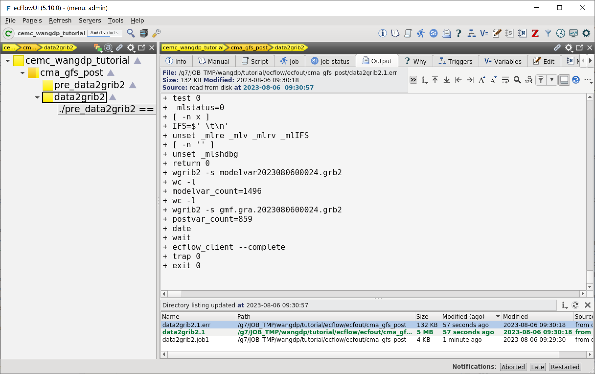

添加第二个任务
==============

下面我们开始使用 ecFlow 构建更复杂的工作流。

首先添加第二个任务 data2grib2，运行后处理程序。

本节将介绍如何在 CMA-PI 上的并行节点上运行 ecFlow 任务。
并行任务与之前创建的串行任务类似，只不过要额外设置运行节点数和每个节点使用的 CPU 个数。

修改工作流定义
--------------

更新 ``${TUTORIAL_HOME}/def`` 中的工作流定义文件 **cma_gfs_post.py**：

.. code-block::
    :linenos:
    :emphasize-lines: 16-25,50-52

    import os

    import ecflow

    def slurm_serial(class_name, wckey):
        variables = {
            "ECF_JOB_CMD": "slsubmit6 %ECF_JOB% %ECF_NAME% %ECF_TRIES% %ECF_TRYNO% %ECF_HOST% %ECF_PORT%",
            "ECF_KILL_CMD": "slcancel4 %ECF_RID% %ECF_NAME% %ECF_HOST% %ECF_PORT%",
        	"CLASS": class_name,
            "WCKEY": wckey,
        }
        return variables

    def slurm_parallel(nodes, tasks_per_node, class_name, wckey):
        variables = {
            "ECF_JOB_CMD": "slsubmit6 %ECF_JOB% %ECF_NAME% %ECF_TRIES% %ECF_TRYNO% %ECF_HOST% %ECF_PORT%",
            "ECF_KILL_CMD": "slcancel4 %ECF_RID% %ECF_NAME% %ECF_HOST% %ECF_PORT%",
            "NODES": nodes,
            "TASKS_PER_NODE": tasks_per_node,
        	"CLASS": class_name,
            "WCKEY": wckey,
        }
        return variables

    current_path = os.path.dirname(__file__)
    tutorial_base = os.path.abspath(os.path.join(current_path, "../"))
    def_path = os.path.join(tutorial_base, "def")
    ecfout_path = os.path.join(tutorial_base, "ecfout")
    program_base_dir = os.path.join(tutorial_base, "program/cma-gfs-post-program")
    run_base_dir = os.path.join(tutorial_base, "workdir")

    defs = ecflow.Defs()

    with defs.add_suite("cma_gfs_post") as suite:
        suite.add_variable("PROGRAM_BASE_DIR", program_base_dir)
        suite.add_variable("RUN_BASE_DIR", run_base_dir)

        suite.add_variable("ECF_INCLUDE", os.path.join(def_path, "include"))
        suite.add_variable("ECF_FILES", os.path.join(def_path, "ecffiles"))

        suite.add_variable("ECF_DATE", "20230806")
        suite.add_variable("HH", "00")

        with suite.add_task("pre_data2grib2") as tk_pre_data2grib2:
            tk_pre_data2grib2.add_variable(slurm_serial("serial", "105-09"))

        with suite.add_task("data2grib2") as tk_data2grib2:
            tk_data2grib2.add_variable(slurm_parallel(4, 64, "normal", "105-09"))
            tk_data2grib2.add_trigger("./pre_data2grib2 == complete")

    print(defs)
    def_output_path = str(os.path.join(def_path, "cma_gfs_post.def"))
    defs.save_as_defs(def_output_path)

新增代码说明：

- 16-25 行定义 ``slurm_parallel`` 函数，定义提交 Slurm 并行作业需要的一些变量。
- 50-52 行定义一个并行任务 data2grib2，使用并行队列 normal 运行，需要 4 个节点，每个节点占用 32 个 CPU 核心。

挂起 cma_tym 节点，更新 ecFlow 上的工作流：

.. code-block:: bash

    cd ${TUTORIAL_HOME}/def
    python3 cma_gfs_post.py
    ecflow_client --port 43083 --replace /cma_gfs_post cma_gfs_post.def

创建头文件
----------

在 ``${TUTORIAL_HOME}/def/include`` 中创建头文件 **slurm_parallel.h**：

.. code-block:: bash

    ## This is a head file for Slurm parallel job.
    #SBATCH -J GRAPES
    #SBATCH -p %CLASS%
    #SBATCH -N %NODES%
    #SBATCH --ntasks-per-node=%TASKS_PER_NODE%
    #SBATCH -o %ECF_JOBOUT%
    #SBATCH -e %ECF_JOBOUT%.err
    #SBATCH --comment=GRAPES
    #SBATCH -t 00:60:00
    #SBATCH --no-requeue
    #SBATCH --wckey=%WCKEY%

创建任务脚本
------------

在 ``${TUTORIAL_HOME}/def/ecffiles`` 中创建 ecf 脚本 **data2grib2.ecf**：

.. code-block:: bash

    #!/bin/ksh
    %include <slurm_parallel.h>
    %include <head.h>
    %include <configure.h>

    date

    #=======================
    forecast_hour=024

    #=======================
    bin_dir=${PROGRAM_BIN_DIR}
    condat_dir=${PROGRAM_CON_DIR}

    run_dir=${CYCLE_RUN_BASE_DIR}

    #------------------------
    INIT_TIME=${START_TIME}

    INIT_DATE=$(echo $INIT_TIME| cut -c1-8)
    HH=$(echo $INIT_TIME| cut -c9-10)

    YY=$(echo $INIT_DATE| cut -c3-4)
    Y4=$(echo $INIT_DATE| cut -c1-4)
    MM=$(echo $INIT_DATE| cut -c5-6)
    DD=$(echo $INIT_DATE| cut -c7-8)
    YM=$(echo $INIT_DATE| cut -c1-6)

    init_time=${INIT_TIME}
    #==============================================#
    # create run directory
    test -d $run_dir || mkdir -p $run_dir
    cd $run_dir

    test -d ${forecast_hour} || mkdir -p ${forecast_hour}
    cd ${forecast_hour}

    #--------------------#
    #-----------------------------#
    # run grapes_post.exe program
    module load compiler/intel/2022.3.0
    module load mpi/intelmpi/2021.6.0

    export OMP_NUM_THREADS=1

    ulimit -s unlimited

    mpirun ./grapes_post.exe

    #---------------------
    # test output
    module load wgrib2/3.1.1/intel

    modelvar_count=$(wgrib2 -s modelvar${init_time}${forecast_hour}.grb2 | wc -l)
    postvar_count=$(wgrib2 -s gmf.gra.${init_time}${forecast_hour}.grb2 | wc -l)
    #------------------
    %include <tail.h>

在 ecFlowUI 上查看运行结果：

可以看到生成了两个 GRIB2 文件：

- modelvar2023080600024.grb2
- gmf.gra.2023080600024.grb2