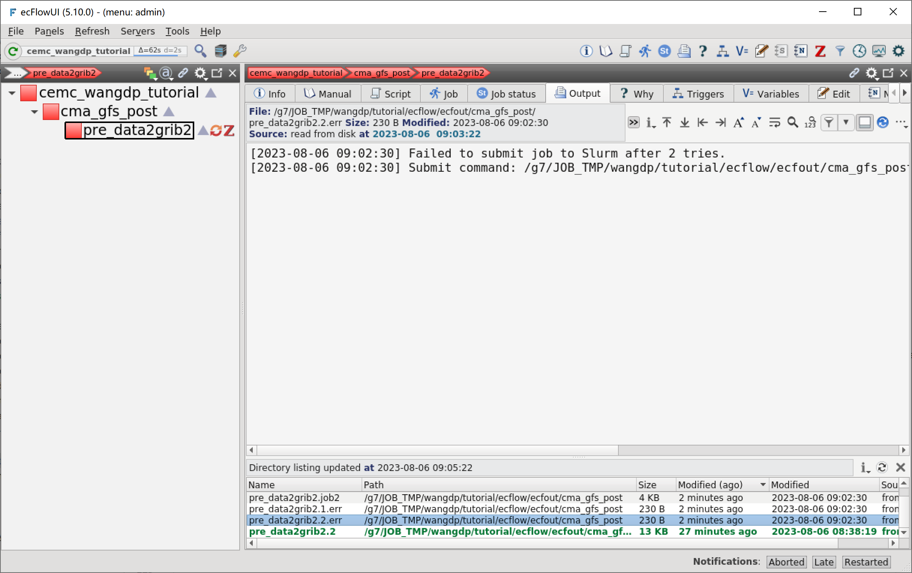
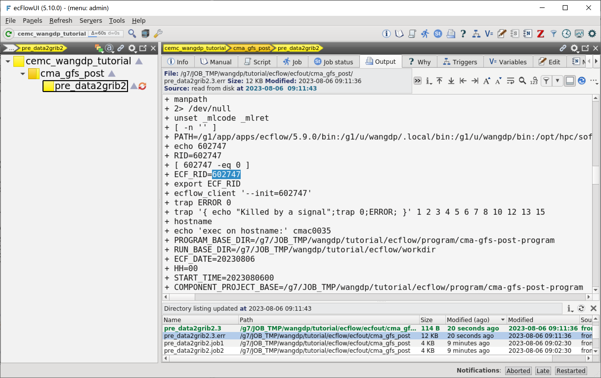

使用Slurm运行任务
=================

上一节中 pre_data2grib2 任务在 ecFlow 服务所在的登录节点运行。
登录节点不适合运行大量的任务，本节中我们将使用 slurm 运行 pre_data2grib2 任务。

本节将介绍如何在 HPC2023 的串行节点上运行 ecFlow 任务，介绍 ecFlow 通过何种方式实现与 HPC 队列调度系统 Slurm 的对接。

修改工作流定义
--------------

更新 ``${TUTORIAL_HOME}/def`` 中的工作流定义文件 **cma_gfs_post.py**：

.. code-block::
    :linenos:
    :emphasize-lines: 6-13,35-36

    import os

    import ecflow

    def slurm_serial(class_name, wckey):
        variables = {
            "ECF_JOB_CMD": "slsubmit6 %ECF_JOB% %ECF_NAME% %ECF_TRIES% %ECF_TRYNO% %ECF_HOST% %ECF_PORT%",
            "ECF_KILL_CMD": "slcancel4 %ECF_RID% %ECF_NAME% %ECF_HOST% %ECF_PORT%",
            "CLASS": class_name,
            "WCKEY": wckey,
        }
        return variables

    current_path = os.path.dirname(__file__)
    tutorial_base = os.path.abspath(os.path.join(current_path, "../"))
    def_path = os.path.join(tutorial_base, "def")
    ecfout_path = os.path.join(tutorial_base, "ecfout")
    program_base_dir = os.path.join(tutorial_base, "program/cma-gfs-post-program")
    run_base_dir = os.path.join(tutorial_base, "workdir")

    defs = ecflow.Defs()

    with defs.add_suite("cma_gfs_post") as suite:
        suite.add_variable("PROGRAM_BASE_DIR", program_base_dir)
        suite.add_variable("RUN_BASE_DIR", run_base_dir)

        suite.add_variable("ECF_INCLUDE", os.path.join(def_path, "include"))
        suite.add_variable("ECF_FILES", os.path.join(def_path, "ecffiles"))

        suite.add_variable("ECF_DATE", "20230806")
        suite.add_variable("HH", "00")

        with suite.add_task("pre_data2grib2") as tk_pre_data2grib2:
            tk_pre_data2grib2.add_variable(slurm_serial("serial", "105-09"))

    print(defs)
    def_output_path = str(os.path.join(def_path, "cma_gfs_post.def"))
    defs.save_as_defs(def_output_path)

新增代码说明：

* 6-13 行：定义函数 ``slurm_serial``，定义了提交 SLURM 串行作业需要的一些 ecFlow 变量：
    - ``ECF_JOB_CMD``：提交作业脚本的命令
    - ``ECF_KILL_CMD``：终止作业脚本运行的命令
    - ``CLASS``：队列名，会在 include 头文件中使用
    - ``WCKEY``：wckey，会在 include 头文件中使用
* 35-36 行：修改 pre_data2grib2 提交方式

运行 **cma_gfs_post.py** 脚本，生成新的 **cma_gfs_post.def** 文件：

.. code-block:: bash

    python3 cma_gfs_post.py

新 cma_gfs_post.def 文件如下：

.. code-block::

    #5.10.0
    suite cma_gfs_post
      edit PROGRAM_BASE_DIR '/g7/JOB_TMP/wangdp/tutorial/ecflow/program/cma-gfs-post-program'
      edit RUN_BASE_DIR '/g7/JOB_TMP/wangdp/tutorial/ecflow/workdir'
      edit ECF_INCLUDE '/g7/JOB_TMP/wangdp/tutorial/ecflow/def/include'
      edit ECF_FILES '/g7/JOB_TMP/wangdp/tutorial/ecflow/def/ecffiles'
      edit ECF_DATE '20230806'
      edit HH '00'
      task pre_data2grib2
        edit ECF_JOB_CMD 'slsubmit6 %ECF_JOB% %ECF_NAME% %ECF_TRIES% %ECF_TRYNO% %ECF_HOST% %ECF_PORT%'
        edit ECF_KILL_CMD 'slcancel4 %ECF_RID% %ECF_NAME% %ECF_HOST% %ECF_PORT%'
        edit CLASS 'serial'
        edit WCKEY '105-09'
    endsuite
    # enddef

更新工作流
-----------

运行 cma_gfs_post.py 生成新的 def 文件不会自动更新 ecFlow 服务里的工作流，需要手动将 def 文件加载到 ecFlow 服务中。

当我们直接使用 ecflow_client 加载 def 文件时，会报错：

.. code-block:: bash

    cd ${TUTORIAL_HOME}/def
    ecflow_client --host login_a13 --port 43083 --load cma_gfs_post.def

报错信息如下：

.. code-block::

    Error: request( --load=cma_gfs_post.def ) failed!  Server reply: Add Suite failed: A Suite of name 'cma_gfs_post' already exist

提示已经存在名为 cma_gfs_post 的 suite，无法加载 def 文件。

这种情况下，我们可以使用 ``replace`` 命令替换 ecFlow 服务中已加载的工作流。

.. code-block:: bash

    ecflow_client --host login_a13 --port 43083 --replace /cma_gfs_post cma_gfs_post.def

重新加载工作流定义后，suite 会立即运行，但 pre_data2grib2 运行报错：

这是因为没有为 pre_data2grib2 任务添加 Slurm 需要的注解设置，所以 Slurm 无法运行脚本。

.. note::

    如果不希望重新加载工作流后任务自动运行，可以将 suite 节点 cma_gfs_post 挂起 (suspend)。
    处于挂起状态下的工作流不会自动运行任务。

    右键单击 cma_gfs_post，选择 Suspend。

    .. image:: image/ecflow-ui-suspend-suite.png

创建头文件
-----------

为使用串行队列的任务创建一个头文件，包含提交串行作业需要的 Slurm 指令。

在 ``${TUTORIAL_HOME}/def/include`` 中创建头文件 **slurm_client.h**：

.. code-block:: bash

    ## This is a head file for Slurm serial job.
    #SBATCH -J GRAPES
    #SBATCH -p %CLASS%
    #SBATCH -o %ECF_JOBOUT%
    #SBATCH -e %ECF_JOBOUT%.err
    #SBATCH --comment=GRAPES
    #SBATCH -t 00:60:00
    #SBATCH --no-requeue
    #SBATCH --wckey=%WCKEY%

修改任务脚本
------------

在 ``${TUTORIAL_HOME}/def/ecffiles`` 中修改 ecf 脚本 **pre_data2grib2.ecf**：

.. code-block:: bash
    :linenos:
    :emphasize-lines: 2

    #!/bin/ksh
    %include <slurm_serial.h>
    %include <head.h>
    %include <configure.h>

    date

    #=======================
    forecast_hour=024

    #=======================
    # ...skip...

在 ecFlowUI 上查看运行结果：

可以看到任务被提交到 Slurm 队列中，ECF_RID 变量保存 Slurm 作业号。