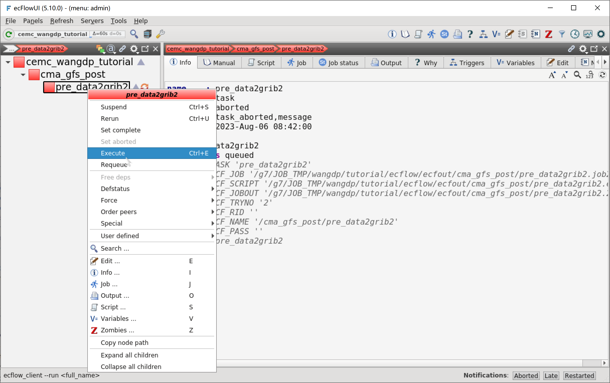
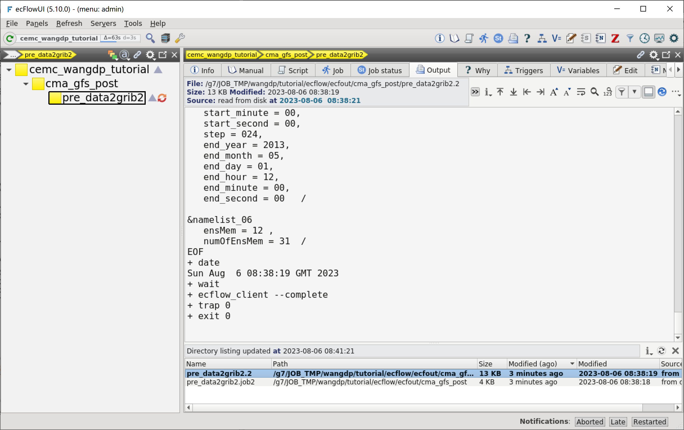
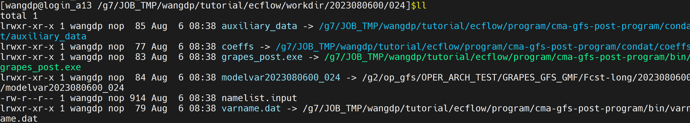

创建任务脚本
=============

下面我们为 pre_data2grib2 任务编写任务脚本。
pre_data2grib2 任务用于将后处理转码需要的程序、配置文件拷贝到运行目录，并生成参数文件 ``namelist.input``。

编写 ecf 文件
--------------

在 ``${TUTORIAL_HOME}/def/ecffiles`` 目录中为 pre_data2grib2 任务创建 ecf 脚本 **pre_data2grib2.ecf**：

.. code-block:: bash

    #!/bin/ksh
    %include <head.h>
    %include <configure.h>

    date

    #=======================
    forecast_hour=024

    #=======================
    bin_dir=${PROGRAM_BIN_DIR}
    condat_dir=${PROGRAM_CON_DIR}

    run_dir=${CYCLE_RUN_BASE_DIR}

    #------------------------
    INIT_TIME=${START_TIME}

    INIT_DATE=$(echo $INIT_TIME| cut -c1-8)
    HH=$(echo $INIT_TIME| cut -c9-10)

    YY=$(echo $INIT_DATE| cut -c3-4)
    Y4=$(echo $INIT_DATE| cut -c1-4)
    MM=$(echo $INIT_DATE| cut -c5-6)
    DD=$(echo $INIT_DATE| cut -c7-8)
    YM=$(echo $INIT_DATE| cut -c1-6)

    init_time=${INIT_TIME}
    start_time=$(${bin_dir}/smsdate $init_time +$forecast_hour)
    end_time=$(${bin_dir}/smsdate $init_time +$forecast_hour)

    #==============================================#
    # create run directory
    test -d $run_dir || mkdir -p $run_dir
    cd $run_dir

    test -d ${forecast_hour} || mkdir -p ${forecast_hour}
    cd ${forecast_hour}

    #--------------------#
    # link programs and condat files.
    rm -rf *

    ln -sf ${bin_dir}/grapes_post.exe .
    ln -sf ${bin_dir}/varname.dat .

    ln -sf ${condat_dir}/auxiliary_data .
    ln -sf ${condat_dir}/coeffs .

    #--------------------#
    # link (or copy) modelvar to local run dir.
    file_path=/g2/op_gfs/OPER_ARCH_TEST/GRAPES_GFS_GMF/Fcst-long/${init_time}/modelvar${init_time}_${forecast_hour}
    test -f ${file_path} || this_is_an_error
    ln -sf ${file_path} modelvar${init_time}_${forecast_hour}

    #--------------------#
    # create namelist.input for grapes_post.exe

    cat > namelist.input <<EOF
    &namelist_01
       s_we = 1,
       e_we = 2880,
       s_sn = 1,
       e_sn = 1441,
       s_vert = 1,
       e_vert = 87,
       idep = 5,
       jdep = 5,
       global_opt = 1,
       spec_bdy_width = 4,
       dt = 600,
       time_step_max = 0,
       time_step_count_output = 36,
       interp = 0,
       vinterp_method = 1,
       nh = 1,
       write_modelvar = .true.,
       xs_we = 0.0,
       ys_sn = -90.0,
       xd = 0.125,
       yd = 0.125,
    !   cross_pole = .false.,
       shw = 1,
       nproc_x =16,
       nproc_y =16/

     &namelist_02
       dyn_opt = 4,
    !   relax_zone = 4,
       num_soil_layers = 5,
       num_coeffs_a_b = 4,
       julyr = 0,
       julday = 1,
       gmt = 0  /

     &namelist_05
       start_year = $Y4,
       start_month = $MM,
       start_day =$DD,
       start_hour =$HH,
       start_minute = 00,
       start_second = 00,
       step = $forecast_hour,
       end_year = 2013,
       end_month = 05,
       end_day = 01,
       end_hour = 12,
       end_minute = 00,
       end_second = 00   /

    &namelist_06
       ensMem = 12 ,
       numOfEnsMem = 31  /
    EOF

    #------------------
    %include <tail.h>

运行任务
--------

有了任务脚本，就可以在在 ecFlowUI 中运行任务。

右键点击 copy_dir 节点，在弹出菜单中选择 Execute，手动运行任务 pre_data2grib2。
因为我们重新运行了一个出错的作业，所以 ecFlowUI 会自动弹出 Restarted 窗口，列出重新启动的任务。

在 ecFlowUI 的 Output 标签中可以看到作业脚本和输出日志文件

查看运行目录：

