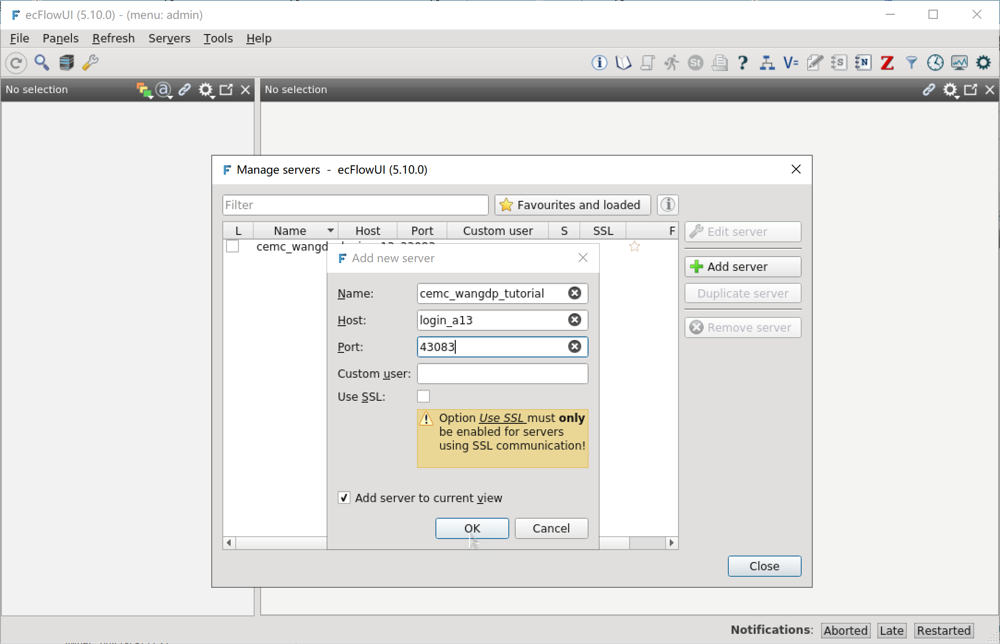
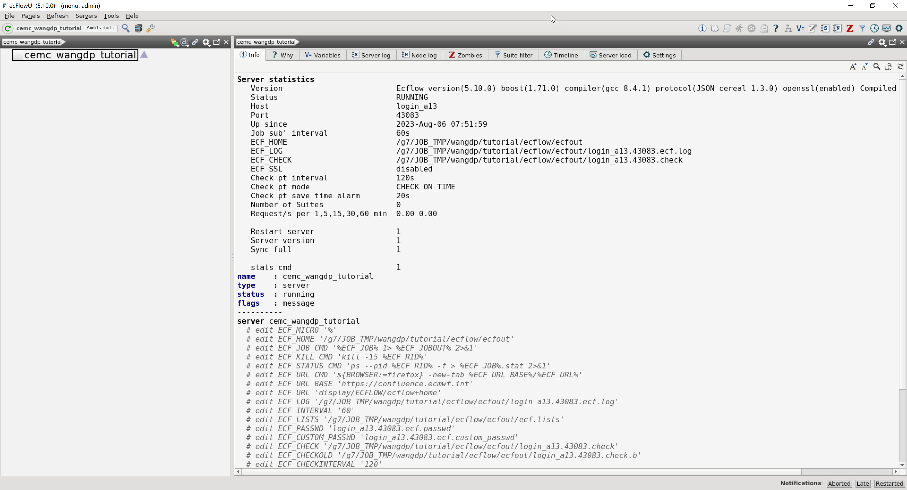

启动 ecFlow 服务
=================

在开始编写 ecFlow 工作流前，先让我们启动一个 ecFlow 服务。

选择端口号
----------

ecFlow 服务需要监听登录节点上的一个端口，启动 ecFlow 前需要先选择一个登录节点和一个端口号。
本教程选择登录节点 **login_a13** (登录IP：10.40.150.29)，并使用  **43083** 作为端口号。

.. warning::

    因后续任务会提交到 Slurm 队列上执行，所以必须选择可以提交作业的登录节点。

    比如 CMA-PI 上 *wangdp* 用户仅能在科研分区上提交作业，所以只能选择 *login_a* 开头的登录节点。

    因为 HPC2023 暂时只有一个子系统，所以尚未限制提交作业的节点。

使用域名登录会自动分配登录节点，为了提高效率，建议在创建 ecFlow 工作流时直接使用 IP 地址登录到 ecFlow 服务运行的登录节点。
比如本教程直接 10.40.150.29 登录 login_a13 节点。

建议使用比较大的端口号，比如本教程使用 *4 + 座机后四位* (4 + 3083) 作为端口号。

启动 ecFlow 服务
----------------

ecFlow 提供 ``ecflow_start.sh`` 脚本用于启动 ecFlow 服务。

查看 **ecflow_start.sh** 脚本的帮助信息：

.. code-block:: shell

    ecflow_start.sh --help

显示如下信息：

.. code-block::

    Usage: /g1/app/apps/ecflow/5.9.0/bin/ecflow_start.sh [-b] [-c] [-d ecf_home_dir] [-f] [-H] [-v] [-s] [-p port]
       -b        start ECF for backup server or e-suite
       -c        test check point file for errors
       -d <dir>  specify the ECF_HOME directory - default /g1/u/wangdp/ecflow_server
       -f        forces the ECF to be restarted
       -H        Halted mode (manual restart), overrides -f option
       -v        verbose mode
       -s        enable ssl server. Requires client/server built with openssl libs
       -h        print this help page
       -p <num>  specify server port number(ECF_PORT number)  - default 1500+<UID> | 1000+<UID> for backup server

在 ``${TUTORIAL_HOME}/ecfout`` 目录中以后台方式运行 ecFlow 服务，端口号为 43083：

.. code-block:: bash

    cd ${TUTORIAL_HOME}/ecfout
    ecflow_start.sh -b -d ${TUTORIAL_HOME}/ecfout -p 43083

显示如下信息：

.. code-block::

    [07:51:58 6.8.2023] Request( --ping ), Failed to connect to login_a13:43083. After 2 attempts. Is the server running ?

    Sun Aug  6 07:51:58 UTC 2023

    User "1050911" attempting to start ecf server on "login_a13" using ECF_PORT "43083" and with:
    ECF_HOME     : "/g7/JOB_TMP/wangdp/tutorial/ecflow/ecfout"
    ECF_LOG      : "login_a13.43083.ecf.log"
    ECF_CHECK    : "login_a13.43083.check"
    ECF_CHECKOLD : "login_a13.43083.check.b"
    ECF_OUT      : "/dev/null"

    client version is Ecflow version(5.10.0) boost(1.71.0) compiler(gcc 8.4.1) protocol(JSON cereal 1.3.0) openssl(enabled) Compiled on May 10 2023 04:07:20
    Checking if the server is already running on login_a13 and port 43083
    [07:51:59 6.8.2023] Request( --ping ), Failed to connect to login_a13:43083. After 2 attempts. Is the server running ?

    Backing up check point and log files

    OK starting ecFlow server...

    Placing server into RESTART mode...

    To view server on ecflow_ui - goto Servers/Manage Servers... and enter
    Name        : <unique ecFlow server name>
    Host        : login_a13
    Port Number : 43083

以上信息表明 ecFlow 服务已正常启动。

.. note::

    如果出现错误信息，可能因为 ecFlow 已经启动或端口号已被占用。
    如果端口号已被占用，请选择一个新的端口号。

使用 ecFlowUI 检查 ecFlow 服务
--------------------------------

启动服务后，可以使用 ecFlowUI 检查 ecFlow 服务是否正常启动。

后台运行模式打开 ecFlowUI 界面：

.. code-block:: shell

    ecflow_ui &

点击 Servers/Manage servers... 菜单，在弹出窗口中点击 Add server 按钮，添加刚启动的 ecFlow 服务：

添加服务后，可以在界面查看 ecFlow 服务信息，请关注右侧 Info 面板的 Status、Host、Port、ECF_HOME 和 ECF_LOG 值：

